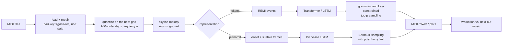
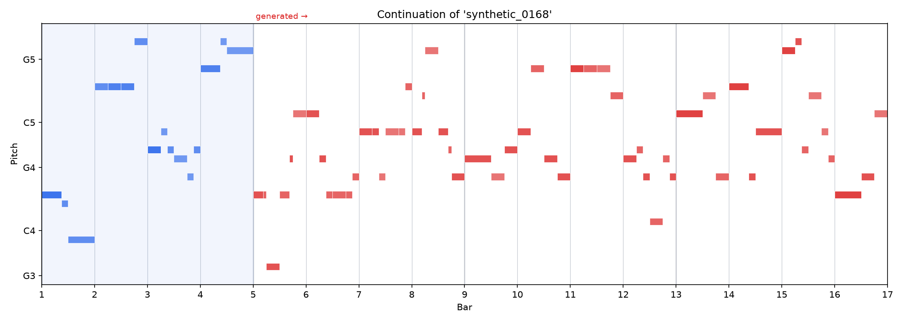
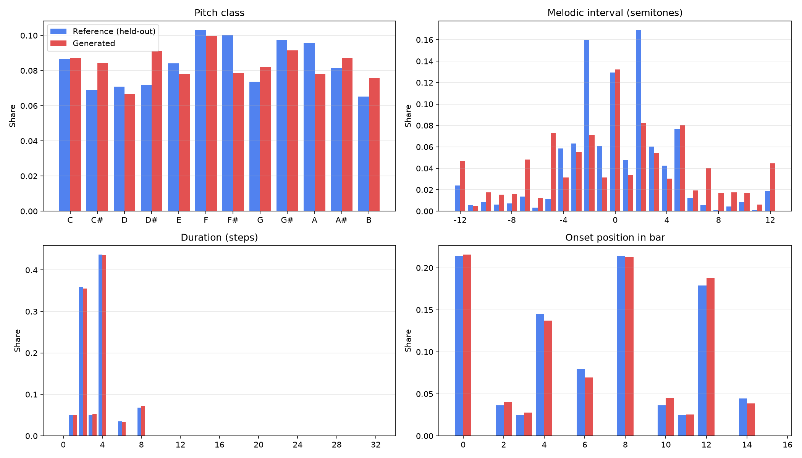
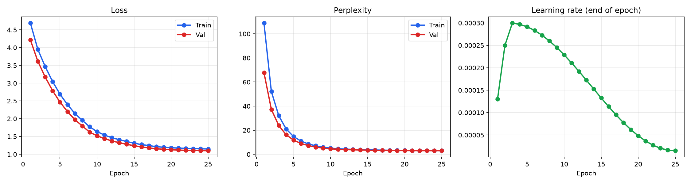

# musegen: neural music generation

[](https://github.com/edwin580/music-generator/actions/workflows/ci.yml)
[](https://colab.research.google.com/github/edwin580/music-generator/blob/main/notebooks/musegen_colab.ipynb)


[](LICENSE)

`musegen` learns melodies from MIDI files and writes new ones. It started as a
COGS-319 (Fall 2024) Colab notebook: an Elman-style LSTM trained on piano rolls.
It is now a tested PyTorch package with:

- **Three models**: a decoder-only Transformer (rotary position embeddings, KV-cache
  decoding), an LSTM language model, and the notebook's original piano-roll LSTM with its bugs fixed.
- **Two representations**: REMI-style event tokens (`BAR / POS / VEL / PITCH / DUR`) and a
  lossless onset+sustain piano roll.
- **Music-aware sampling**: temperature, top-k and nucleus (top-p) sampling. A grammar mask
  guarantees every generated sequence decodes to valid music. An optional key constraint
  (`--key "A minor"`, or `auto` to detect the key of the prompt with the Krumhansl-Schmuckler algorithm)
  keeps pitches in a scale.
- **Robust MIDI processing**: quantization against the file's own beat grid (tempo-aware),
  skyline melody extraction, drum-track filtering, and repair of malformed files such as
  the one that crashed the notebook ("Could not decode key with 16 sharps").
- **Honest evaluation**: train/validation/test splits made per file (no overlapping windows
  leaking across splits), held-out perplexity, and musical statistics of generated continuations
  compared with the real continuations (scale consistency, key clarity, interval and rhythm
  distributions, motif repetition, and so on), with plots.
- **Tooling**: a `musegen` command-line tool, YAML presets with `--set key=value` overrides,
  checkpoints, piano-roll and distribution plots, WAV rendering (FluidSynth or a built-in
  piano-like synthesizer), 66 tests, and GitHub Actions CI.

---

## Quickstart

```bash
git clone https://github.com/edwin580/music-generator.git && cd music-generator
pip install -e ".[dev]"            # add ".[audio]" + system FluidSynth for SoundFont rendering

# 1. data: the notebook's MIDIWorld sample set, a synthetic corpus, or your own folder of .mid files
musegen download --dest data/midi
musegen synth-data --dest data/synthetic --n 256      # offline alternative

# 2. train (presets: transformer | lstm | pianoroll_lstm | smoke)
musegen train -c transformer --midi-dir data/midi --set train.epochs=40

# 3. generate: 16 bars in A minor, rendered to MIDI + WAV + piano-roll PNG
musegen generate -m runs/transformer/best.pt -o output/song.mid \
    --bars 16 --key "A minor" --temperature 0.9 --top-p 0.95 --seed 7 --wav --plot

# ...or continue the first 4 bars of an existing piece, in that piece's key
musegen generate -m runs/transformer/best.pt -o output/continuation.mid \
    --prompt some_song.mid --prompt-bars 4 --bars 12 --key auto --wav --plot

# 4. evaluate against held-out music (writes report.md, report.json, figures, samples)
musegen evaluate -m runs/transformer/best.pt --num-samples 32

# utilities
musegen analyze some_song.mid --plot output/analysis.png   # key, statistics, piano roll
musegen render output/song.mid                              # MIDI -> WAV
```

To confirm an installation end to end in about 10 seconds on a CPU:
`musegen synth-data && musegen train -c smoke`.
To train on a Colab GPU, use the [notebook](notebooks/musegen_colab.ipynb).

## How it works



### Representation

The token representation follows REMI (Huang & Yang, 2020). A bar of melody looks like:

```
BAR  POS_0 VEL_5 PITCH_69 DUR_4   POS_4 VEL_4 PITCH_72 DUR_2   POS_6 VEL_4 PITCH_71 DUR_2   POS_8 ...
```

Every note is an explicit (position, velocity, pitch, duration) group. Generation becomes
ordinary next-token classification, held notes and repeated notes are distinct, and the
model sees bar lines and beat positions directly. With the default settings the vocabulary
has 148 tokens.

Because the grammar is regular (`POS → VEL → PITCH → DUR`, positions increase within a bar),
`GrammarState` computes the set of legal next tokens at every step and sampling is masked to
it. Pitch constraints (a key, a register, monophony) are applied through the same mask.

### Models

| preset | model | input | notes |
|---|---|---|---|
| `transformer` | decoder-only Transformer | REMI tokens | pre-LayerNorm, RoPE, fused causal attention, KV cache with a sliding window for long generation |
| `lstm` | LSTM language model | REMI tokens | the notebook's recurrent approach, on the better representation |
| `pianoroll_lstm` | LSTM, multi-label output | onset + sustain frames | the notebook's model, fixed (see below) |

All three train with AdamW, warm-up followed by cosine learning-rate decay, gradient clipping,
early stopping and (on CUDA) mixed precision.

### Evaluation

`musegen evaluate` takes the opening bars of each held-out test piece as a prompt, generates
a continuation, and compares it with the piece's real continuation:

- **likelihood**: test loss and perplexity (token models) or frame precision/recall/F1 (piano roll);
- **per-piece statistics**: notes per bar, pitch range, pitch-class entropy, *scale consistency*,
  *key clarity* (correlation with the best Krumhansl-Kessler key profile), mean interval, share of
  leaps larger than a fifth, *repetition ratio* (transposition-invariant motif re-use), rhythmic
  entropy, empty bars;
- **distribution similarity** (Yang & Lerch, 2020): overlap area and Jensen-Shannon divergence
  between generated and real histograms of pitch class, melodic interval, duration and onset position.

## Results

These numbers come from a short **CPU-only benchmark on the synthetic corpus**
(`musegen synth-data --n 256`: 256 procedurally composed 16-bar pieces, split 204/26/26 by file).
Each model trained for 25 epochs, a few minutes each. The runs had not converged, so treat this
as a check that the pipeline works and a comparison of the models, not as final quality. On the
real MIDIWorld set, or with a Colab GPU and more epochs, expect different numbers.
Reproduce with:

```bash
musegen synth-data --dest data/synth256 --n 256 --seed 7
musegen train -c transformer --midi-dir data/synth256 --output-dir runs/synth_transformer \
    --set model.d_model=128 model.n_layers=4 model.n_heads=4 data.seq_len=256 data.stride=128 train.epochs=25
musegen evaluate -m runs/synth_transformer/best.pt --num-samples 32 --bars 12 --prompt-bars 4 [--key auto]
```

Evaluation takes 32 samples (cycling through the 26 test pieces): each continues 4 bars of a held-out prompt for 12 bars.

| model | params | held-out likelihood | scale consistency | key clarity | pitch-class OA | interval OA | rhythm (onset) OA |
|---|---|---|---|---|---|---|---|
| real continuations | – | – | 1.000 | 0.762 | – | – | – |
| Transformer | 0.81 M | perplexity **3.01** | 0.793 | 0.614 | 0.93 | 0.72 | 0.97 |
| Transformer + `--key auto` | | | **1.000** | **0.786** | 0.94 | 0.73 | 0.97 |
| LSTM (tokens) | 1.09 M | perplexity **2.62** | 0.792 | 0.553 | 0.91 | 0.81 | 0.98 |
| LSTM (tokens) + `--key auto` | | | **1.000** | 0.705 | 0.90 | 0.81 | 0.98 |
| piano-roll LSTM (notebook model, fixed) | 1.14 M | frame F1 0.67 | 0.841 | 0.708 | 0.90 | 0.80 | 0.76 |
| piano-roll LSTM + `--key auto` | | | 0.999 | 0.774 | 0.93 | 0.76 | 0.80 |

*OA = overlap area between the generated and real histograms (1.0 = identical distributions).*

What the numbers show:

- **The token models get rhythm almost exactly right** (onset-position and duration OA of
  0.97-0.99). The piano-roll model, with no explicit notion of bars or durations, reaches only 0.76-0.81.
  This is the main reason to prefer the REMI representation.
- **The key constraint helps.** Without it, about 20% of generated notes fall outside the
  best-fitting scale. With `--key auto`, every note is in the key of the prompt and tonal clarity
  rises to or above that of the real music, with no retraining.
- **All models are still weak at long-range structure.** The real continuations reuse their
  4-bar motifs (repetition ratio 0.55); generated ones essentially never do (≈0.00). The Transformer
  also leaps more than the real music (mean interval 5.2 vs 3.3 semitones). More training, longer
  context and larger models are the obvious next steps; this is the gap the Transformer's
  attention should eventually close.
- At this tiny scale the LSTM has lower perplexity than the Transformer (2.62 vs 3.01). Transformers
  usually need more data and training before they pull ahead.

<p align="center">
  <br>
  <em>Transformer continuation of a held-out piece: 4 prompt bars (blue), 12 generated bars (red), key-constrained.</em>
</p>

<p align="center">
  <br>
  <em>Pooled statistics of generated vs. real continuations. Rhythm is matched closely; intervals are too wide.</em>
</p>

<p align="center">
  <br>
  <em>Transformer training: loss, perplexity and the warm-up/cosine learning-rate schedule. Validation loss
  is below training loss because dropout and transposition augmentation apply only in training.</em>
</p>

## What changed from the notebook

The original notebook is preserved in [`legacy/original_notebook.py`](legacy/original_notebook.py).
Reviewing it turned up these problems:

| # | problem in the notebook | effect | fix |
|---|---|---|---|
| 1 | `get_piano_roll(fs=steps_per_beat)` treats `fs` as frames **per second**, not per beat | "4 steps per beat" was really 4 frames per second at any tempo, so rhythms were quantized inconsistently across songs | quantize against the file's beat grid (`data/midi_io.py`) |
| 2 | temperature applied as `softmax(log p / T)`, followed by independent Bernoulli draws per note | softmax forces the 128 note probabilities to sum to 1, discarding the sigmoid's per-note confidence; `log(0)` gives `-inf` | Bernoulli temperature `sigmoid(logit / T)`; categorical top-k/top-p for token models (`generation.py`) |
| 3 | stride-1 windows shuffled together, then `validation_split=0.2` | validation windows overlap training windows by 47 of 48 frames, so validation loss says little about generalization | per-file train/val/test split, strided bar-aligned windows (`data/dataset.py`) |
| 4 | `metrics=['accuracy']` on a sparse 128-way multi-hot target | the reported ~25% "accuracy" is hard to interpret | perplexity / token accuracy, or frame precision/recall/F1 (`training/trainer.py`) |
| 5 | "monophonic melody" kept every chord in the chosen instrument | output was not actually monophonic | skyline reduction (`midi_io.skyline`) |
| 6 | melody instrument chosen by `max(mean pitch)` over **all** instruments | could pick the drum kit (drum "pitches" are high) and fails with `np.mean([])` on empty tracks | ignore drums and near-empty tracks |
| 7 | every active frame written as a separate 0.25 s note | held notes were re-struck every sixteenth | notes carry durations; the piano roll has an onset channel (`data/pianoroll.py`) |
| 8 | binary piano roll | cannot tell one long note from repeated short ones | onset + sustain channels, or REMI tokens |
| 9 | files with invalid meta events crashed the loader (`sample_28.mid`) | usable songs were skipped | lenient re-parse with mido (`load_midi`) |
| 10 | `model.predict` on the whole window for every generated step | quadratic and slow | recurrent state / KV cache, O(1) work per step |
| 11 | songs truncated at `max_sequence_length=2000` frames | the rest of each long song was unused | whole pieces are used |
| 12 | `synthesize()` sine waves written to `output_test.mp3` | "beeps", and a WAV file with an .mp3 name | FluidSynth SoundFont or a piano-like additive synthesizer, written as a real 16-bit WAV (`audio.py`) |
| 13 | "original" plots showed one random shuffled 48-step window | not comparable with the generated output | prompt vs. continuation piano roll; set-level distribution comparison |
| 14 | `sequence_length` defined in two places (24 vs. 48) | easy to get out of sync | one typed `ExperimentConfig` |
| 15 | everything runs inside one `main()`, so plots end up out of scope | the notebook had to save figures and reload them as images | a package: library modules, CLI, notebook |

## Project layout

```
src/musegen/
  config.py            typed experiment config, YAML presets, --set overrides
  configs/             transformer / lstm / pianoroll_lstm / smoke presets
  theory.py            notes, keys, scales, Krumhansl-Schmuckler key finding
  data/
    midi_io.py         robust loading, tempo-aware quantization, skyline, MIDI writing
    tokenizer.py       REMI tokenizer + GrammarState (constrained decoding)
    pianoroll.py       lossless onset/sustain piano roll
    dataset.py         corpus cache, per-file splits, windowed datasets, augmentation
    sources.py         MIDIWorld downloader, synthetic composer
  models/              transformer.py, lstm.py, factory + checkpoint I/O
  training/            Trainer (AdamW, warmup-cosine, AMP, early stopping), pipeline
  generation.py        sampling (top-k / top-p / temperature / grammar / key / polyphony)
  evaluation/          musical metrics, set comparisons, reports
  visualization.py     piano rolls, training curves, distribution plots, key profiles
  audio.py             FluidSynth or built-in synthesis -> WAV
  cli.py               `musegen` command-line tool
tests/                 66 tests: unit, property-style, end-to-end
notebooks/             Colab notebook
legacy/                the original COGS-319 notebook code
```

Run the checks with `ruff check . && pytest`.

## Background

The project began in COGS-319 (Fall 2024) and drew on the course labs: *Finding Structure in
Time* (Elman, 1990; Lab 5), where a recurrent network learns temporal structure by predicting
the next element of a sequence; *Transformers* (Lab 11); *Semantic Cognition* (Lab 4);
and *Action Selection* (Lab 6). The original goal of genre conversion or endless song
continuation was cut back to melody generation to fit the semester. This version adds
continuation of a prompt (`--prompt`) and conditioning on a key (`--key`).

Possible next steps: conditioning on genre or tempo tokens, a larger corpus
(e.g. the Lakh MIDI Dataset), polyphonic multi-track generation, and a listening study to
check the objective metrics against human judgments.

## References

- Elman, J. L. (1990). Finding structure in time. *Cognitive Science*, 14(2), 179-211.
- Krumhansl, C. L., & Kessler, E. J. (1982). Tracing the dynamic changes in perceived tonal organization in a spatial representation of musical keys. *Psychological Review*, 89(4), 334-368.
- Huang, Y.-S., & Yang, Y.-H. (2020). Pop Music Transformer: Beat-based modeling and generation of expressive pop piano compositions. *ACM Multimedia*.
- Huang, C.-Z. A., et al. (2019). Music Transformer. *ICLR*.
- Su, J., et al. (2021). RoFormer: Enhanced Transformer with rotary position embedding. *arXiv:2104.09864*.
- Holtzman, A., et al. (2020). The curious case of neural text degeneration. *ICLR*.
- Yang, L.-C., & Lerch, A. (2020). On the evaluation of generative models in music. *Neural Computing and Applications*, 32, 4773-4784.

## License

MIT, © Edwin Cortazo
